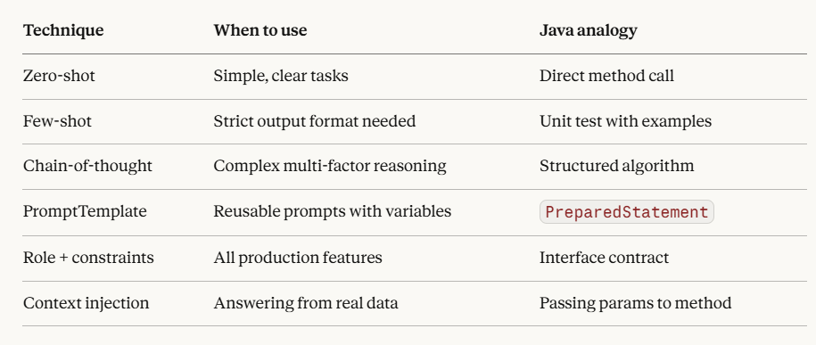

# Spring AI Lab — 8-Hour Hands-On Workspace

Isolated practice environment. Your production code is untouched.

## Prerequisites

| Tool | Version | Check |
|------|---------|-------|
| Java | 17+ | `java -version` |
| Maven | 3.9+ | `mvn -version` |
| Docker | 24+ | `docker -version` |
| Docker Compose | v2+ | `docker compose version` |

---

## Start in 3 commands

```bash
# 1. Start PostgreSQL + pgAdmin
docker compose up -d

# 2. Set your OpenAI API key
export OPENAI_API_KEY=sk-your-key-here

# 3. Run the app
mvn spring-boot:run
```

---

## Verify everything works

```bash
# Run the setup verification tests
mvn test -Dtest=AiSetupVerificationTest

# Expected output:
# ✅ Spring Boot context started successfully
# ✅ Database has 50 customers
# ✅ Premium churn risk (>30 days inactive): 3 customers
# ✅ OpenAI response: Spring AI lab is ready. Hour 1 complete.
# ✅ Customer base overview: Total: 50 | Active: 42 | Churned: 3
```

---

## URLs when running

| URL | What |
|-----|------|
| http://localhost:8080/api/customers | All 50 customers |
| http://localhost:8080/api/customers/stats | Plan/status summary |
| http://localhost:8080/api/customers/churn-risk | Premium churn risk |
| http://localhost:8080/api/customers/inactive/30 | Inactive 30+ days |
| http://localhost:8080/actuator/health | App health |
| http://localhost:5050 | pgAdmin (admin@ailab.com / admin123) |

---

## Project structure

```
spring-ai-lab/
├── docker-compose.yml          ← PostgreSQL 16 + pgvector + pgAdmin
├── init-db.sql                 ← Enables pgvector extension on first start
├── .env.example                ← Copy to .env and add your OpenAI key
├── pom.xml                     ← Spring Boot 3.2 + Spring AI 1.0
└── src/
    ├── main/
    │   ├── java/com/ailab/customer/
    │   │   ├── SpringAiLabApplication.java
    │   │   ├── model/Customer.java         ← JPA entity (FREE/BASIC/PREMIUM/ENTERPRISE)
    │   │   ├── repository/CustomerRepository.java
    │   │   ├── service/CustomerService.java
    │   │   ├── controller/CustomerController.java
    │   │   └── ai/AiConfig.java            ← Grows each hour
    │   └── resources/
    │       ├── application.yml             ← DB + AI config
    │       └── db/migration/
    │           ├── V1__create_customers_table.sql
    │           └── V2__seed_customers.sql  ← 50 realistic customers
    └── test/
        └── AiSetupVerificationTest.java    ← Verify Hour 1 setup
```

---

## What gets added each hour

| Hour | Files added/modified |
|------|---------------------|
| 2 | `ai/PromptEngineeringService.java`, new endpoints in controller |
| 3 | `ai/CustomerChatService.java`, `POST /api/customers/ai/chat` |
| 4 | `ai/CustomerAiTools.java` — @Tool function calling |
| 5 | `ai/EmbeddingService.java`, `ai/RagIngestionService.java` |
| 6 | `ai/RagQueryService.java`, vector store queries over customer notes |
| 7 | `ai/LangChain4jAgentService.java` — agent with memory |
| 8 | `ai/AiObservabilityConfig.java`, retry/fallback, token budgeting |

---

## Reset everything

```bash
# Wipe DB and start fresh
docker compose down -v
docker compose up -d
mvn spring-boot:run
```

## Hour 2 - Key Concepts

